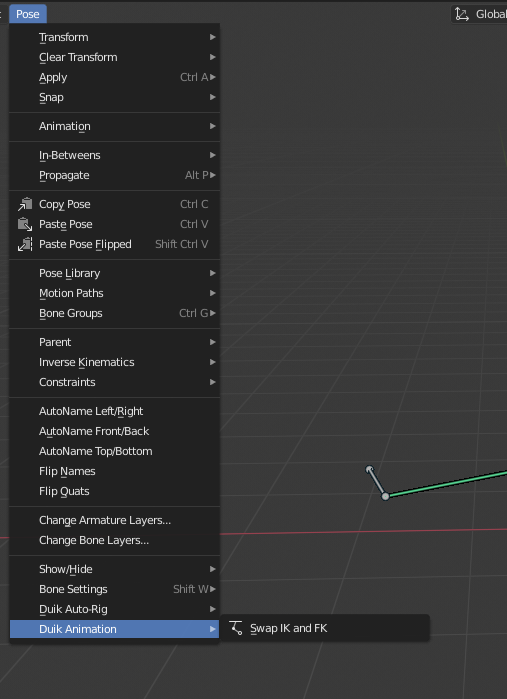

*Duik* provides some tools to ease the work of the animator, in conjunction with its rigging tools.

`3D View ‣ Menu ‣ Pose`  
Available in *pose mode* only

They are also available as a pie menu with the `[SHIFT] + [D]` keyboard shorcut.

## Swap IK and FK

This tool is used with limbs rigged using the [IK/FK rig](ikfk.md).  
It automatically detects if the active controller is used to control the corresponding limb with *IK* or *FK*, and automatically aligns either the *FK* controls or the *IK* controls, then switches them. It also adds the necessary keyframes on the controllers.  
It's a quick and easy way to animate both in IK and FK in during the same action.

*Last Modified on *