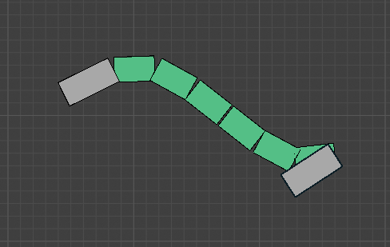

`3D View ‣ Menu ‣ Pose ‣ Duik Auto-Rig`  
`3D View ‣ [SHIFT + R]`  
Available in *pose mode* only

Select one bone (with some bendy bones subdivision) and launch the tool.

This will add one controller at each end of the bendy-bone, to easily control the end positions and orientations. The scale also controls the curvature the bendy-bone.

!!! hint
    This tool is very useful for not-too-realistic spines or for tails.

The controls for the options are added as custom properties on the controllers bone.
You can find them in the sidebar [N] of the *3D View* with the controller selected.

The *Rotation Influence* property can be used to adjust the sensibility of the control on the curve with the rotations of the controllers.

*Last Modified on *