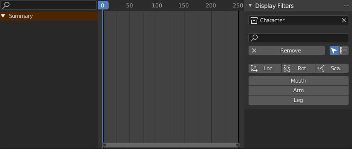

# Dope Sheet and Graph Editor filters

The add-on will add a few tools in the side panel of the Dope Sheet and the Graph Editor to ease the process of filtering displayed properties.

## Timeline

`Dope Sheet Panel ‣ Sidebar ‣ View Tab`  
`Graph Editor Panel ‣ Sidebar ‣ View Tab`

### Options

- Change the **collection** to display only properties from a specitif collection
- Use the **search field** to input custom names
- The **remove** button will clear all filters and turn on the *Only show selected* option.
- Next to the remove button, there are two options:
    - ***Only show selected*** will display properties only for selected objects.
    - ***Fuzzy/Multi-Word name filtering*** matches word snippets/partial words, instead of having to match everything. It breaks down the search string based on white-space placement. e.g. “lo ro” will filter all location and rotation, while “lc rt” will not work.

### Filters

The add-on adds three filters by default, to display only the location, rotation or scale of the selected objects.

Under these default filters, the add-on adds custom filters, which you can manage on armature objects

## Armatures and custom filters

Custom filters are managed on armature objects. Each armarture adds its own filters to the list.

`Properties Panel ‣ Armature Data ‣ Dopesheet Display Filters`

You can re-organize the filters with the up and down button; they will be sorted in the same order in the *Dope Sheet* and *Graph Editor* panel.

Each filter has two options:

- ***Only show selected*** will filter only among the selected objects.
- ***Fuzzy/Multi-Word name filtering*** matches word snippets/partial words, instead of having to match everything. It breaks down the search string based on white-space placement. e.g. “lo ro” will filter all location and rotation, while “lc rt” will not work.

!!! hint
    To add filters if don't have any armature, just add one to the scene.