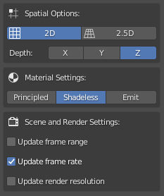
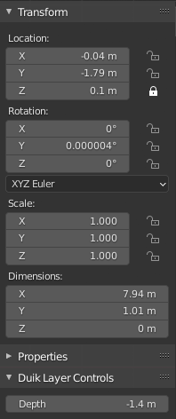

# OCA in Blender

OCA is an open format to ease the exchange of traditionnal/frame-by-frame/cel animation between different applications. e.g. you can now import a 2D animation made in [*Krita*](http://krita.org) in *Blender*, keeping all the layers, the keyframes, etc.

[TOC]

With this add-on, you can import the [OCA](https://rainboxlab.org/tools/oca) Format in Blender.

It is able to import all animation keyframes from an OCA document, keeping the layer structure, and a lot of other information.

The documentation about OCA is available on [oca-docs.rainboxlab.org](htpp://oca-docs.rainboxlab.org).

## Features

This OCA importer will import the most common features of all drawing/animation software:

- Import the layers as planes
- Layer groups as Collections and a parent empty
- Layer labels as viewport display color
- Layer visibility
- Keyframes as animated textures
- Opacity keyframes
- Layer sizes and coordinates *only for non-animated layers*
- Document background color as a background plane

!!! Note
    To import animated layers, they must be exported as document size and not keeping the layer size.

## Options

`Top bar ‣ File Menu ‣ Import ‣ OCA as Duik 2D scene`

You can change a few options when importing your OCA file:

- ***`2D/2.5D`*** will set the camera as orthogonal or perspective. In the future, this option will also change how depth is handled.
- ***`Depth axis`*** lets you choose which axis is facing the depth of the scene.
- ***`Material Settings`*** lets you change the way the shading is handled on the planes.
- ***`Scene and Render settings`*** lets you update the scene settings to match the incoming animation.

### Shading

- ***Principled*** is a standard shader.
- ***Shadeless*** renders the layer as it is, without taking any light and without having any influence in the scene and indirect illumination.
- ***Emit*** uses an emission shader, and, in *Cycles*, the other objects will get the color of the layer. In *Eevee* it is the same as *shadeless*.

### Keyframes and opacity

Layer animation (i.e. keyframes) are imported as animated textures, using the [*Texture Animation*](texanim.md) module.

Opacity keyframes are imported on a *Math* node in the shader which multiplies the *alpha* of the image. Opacity keyframe interpolation is set to *constant* by default.

# Use

The add-on will set your 2D scene up automatically, and adds a camera to view it.

In the item parameters, when an imported layer is selected, you can easily move the layer along the depth axis using the `Depth` value in the `Duik Layer Controls` group.