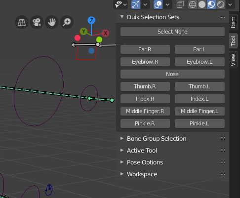

# Selection sets

[TOC]

## Manage

`Properties Panel ‣ Armature Data Tab ‣ Duik Selection Sets`

With *Duik*, you can easily create selection sets on your armatures.

In the `Armature data` tab of the `Properties` panel, you'll find the *Duik Selection Sets* Panel.

Select some bones and click on the `+` button to create a selection set containing these bones.

Use the `Assign` and `Remove` buttons to assign or remove bones to and from the active selection set.

## Use

`3D View ‣ Sidebar ‣ Tool Tab ‣ Duik Selection Sets`

When you have some selection sets, they will be available in the *sidebar* of the *3D View*, in the `Tool` tab.

Duik will try to build a nice layout, depending on the names of the sets, and their order in the list. Each time an *.R* suffix followed by an *.L* suffix is found, the two sets are showed in a row.

Just click on the buttons to select all the bones contained in the corresponding selection set. This is very useful to quickly select and animate all FK controls of a finger for example.

*Last Modified on *