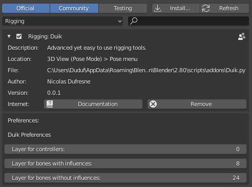
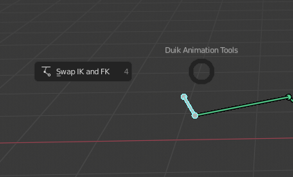

# Settings

[TOC]

## Introduction

The settings of the add-on are available in the preferences of *Blender* available in the `Edit/Preferences...` menu.
Duik is listed in the `Rigging` category in the `Add-ons` tab.

## Layers

The bones are automatically sorted in layers to keep things tidy.

The bones used as controllers are in the first layer by default, the bones with influences (which are *skinned*) are in the 8th, and the all the other bones, used by the constraints, are in the 24th layer. You can change this the way yuou prefer in the preferences.

## Pie Menus

#### (Auto)Rigging tools

You can use a nice pie menu to quickly access the (auto)rigging tools using the `[SHIFT] + [R]` keyboard shortcut.

#### Armature Display

With the `[SHIFT] + [V]` keyboard shortcut, you can quickly change the display of the active armature.

#### Animation tools

The `[SHIFT] + [D]` keyboard shortcut shows a pie menu with useful animation tools.

If you'd prefer not to use these pie menus and keep their shortcuts for something else, you can de-activate them in these settings.

*Last Modified on *