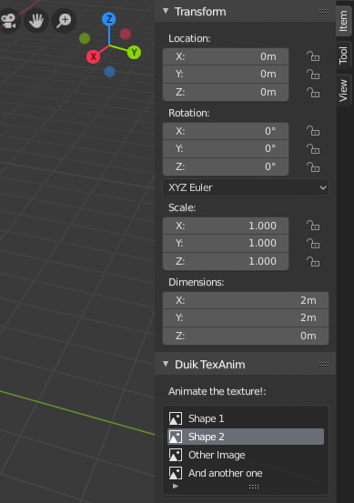

Duik includes a tool to make it easy to *animate* textures, i.e. to be able to change and keyframe which texture is displayed. For example, this can be used to switch different mouth shapes for a very cartoonish render where mouthes of the characters are drawn in 2D in another software. It's also an easy way to animate a frame sequence with a precise control, not just playing it at a specific frame rate.

!!! note
    This could be achieved using actual frame sequences and a scripted driver on the *offset* property, but this tool fixes three issues:  

    - With frame sequences, each frame is not kept in memory, and this has a bad impact on the playback performance in the viewport when textures are displayed. This is not an issue with the way Duik handles this *Texture Animation* tool.

    - On the contrary to frame sequences, you can animate the actual list of images, and not a number corresponding to a frame. This is a lot easier to select specific images/frames instead of having to remember their numbers.

    - This *Texture Animation* tool allows you to select individual images, which may not be numbered, named the same way or even not stored in the same folder.

The *Duik TexAnim* section appears in the sidebar of the Shader Editor when an *Image Texture* node is selected.

There you can use the *+* and *-* buttons to add and remove images, and change their order.

The *Current image* property shows the number of the selected image and you can choose a name for this specific *TexAnim*.

You can use the *Copy control to active object* and *Remove control from active object* buttons to add or remove a copy of the list in the sidebar of the 3D View (N), when the active object is selected. This is a nice way to expose the list to make it more accessible for animation. **This list can be keyframed**.

!!! tip
    If the active object is a bone in *Pose* mode, the list is displayed only when this bone is selected, not the whole armature. Out of the *Pose* mode, the list is linked to the armature object and not any specific bone.

!!! hint
    The list is actually linked to the node in the shader, not any object. This means the keyframes are shown by default in the *dope sheet* and *graph editor* only when the node is selected. Deselect the "*Only Selected*" option to see these keyframes even when the shader editor is closed, and use the filters (especially the *collection* filter) to better sort all the keyframes.