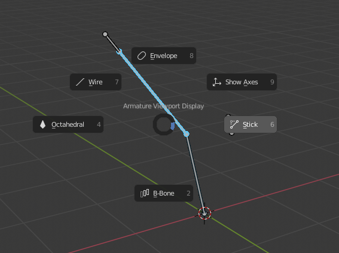

[TOC]

## Menus

With an *Armature* in *Pose* mode, you'll find a *Duik* section in the `Pose` menu of the *3D View*, which contains the rigging tools available.

These rigging tools are also quickly accessible through a *pie menu*, using the `[SHIFT] + [D]` keyboard shortcut in the *3D View* in *Pose* mode.

Another pie menu accessible with the `[SHIFT] + [V]` keyboard shortcut allows you to change the display of the active armature very quickly.

## Controls, bones and layers

All these tools are bits of auto-rigs, and create nice controls.

The controllers are bones which are named with the ".Ctrl" suffix to make them easy to find.

These tools create some other bones needed for the rig, but the ones you'll need to influence your mesh objects are always the ones you've created yourself before using these tools, located by default in the 8th layer.

You can change the layers used by Duik in the [settings](settings.md) of the add-on.

*Last Modified on *